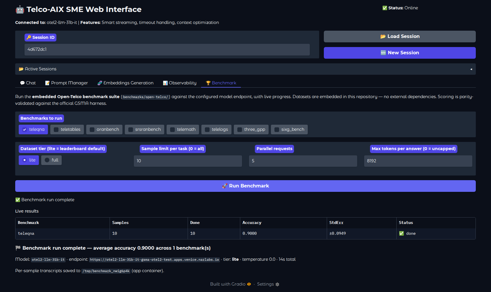
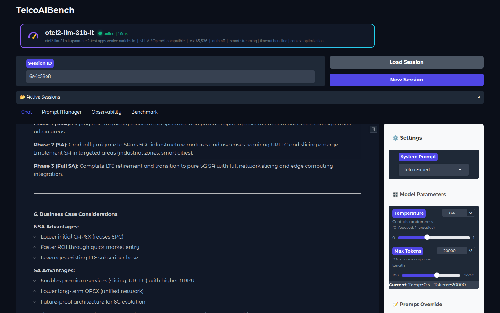
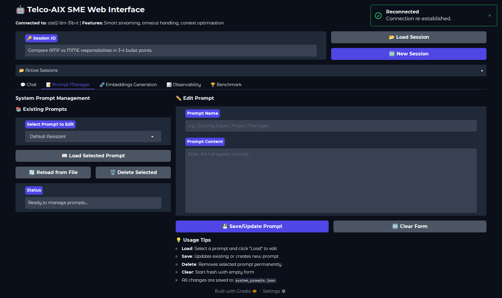
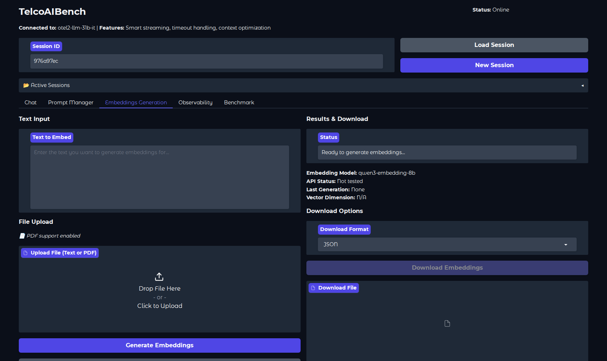
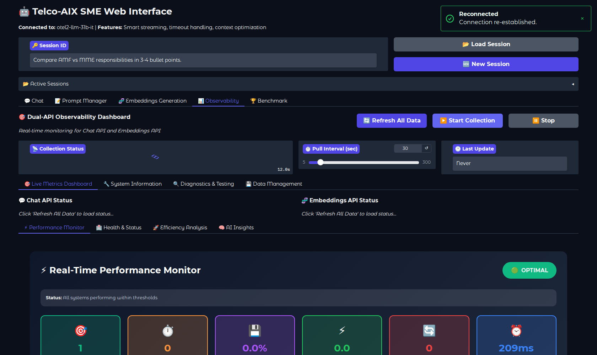
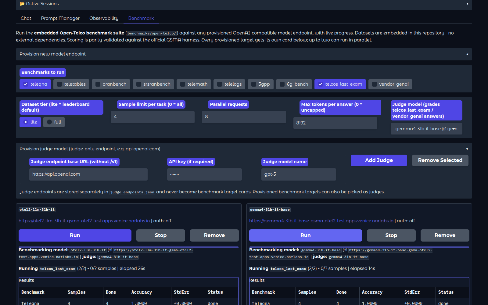

<div align="center">


**A self-contained portal & benchmark suite to measure any telco AI model - chat with it, watch it, benchmark it.**

[](LICENSE)
[](https://www.python.org/)
[](https://gradio.app)
[](benchmarks/README.md)
[](benchmarks/open-telco/datasets/PROVENANCE.md)

 [Demo Video](https://youtu.be/UQB1T-ThQBk) &nbsp;|&nbsp;  [Article](https://medium.com/open-5g-hypercore/episode-xxix-the-prompt-engineering-how-to-make-a-toddler-act-talk-nice-83e9aab2e3b9) &nbsp;|&nbsp;  [Benchmark Suites](benchmarks/README.md) &nbsp;|&nbsp;  [Verification Report](benchmarks/open-telco/reference/)



</div>

---

## What is TelcoAIBench?

Point it at **any OpenAI-compatible endpoint** (vLLM, RHOAI/KServe, TGI, SaaS)
with two environment variables, and you get three things:

|  **Portal** |  **Benchmark Suite** |  **Receipts** |
|---|---|---|
| Expert telco chat personas, embeddings playground, and a live vLLM observability dashboard - persistent sessions, streaming, file upload. | The 8 Open-Telco benchmarks (TeleQnA, TeleTables, TeleMath, TeleLogs, 3GPP-TSG, ORANBench, srsRANBench, 6G-Bench) with **datasets embedded in this repo** - run from the UI or CLI, no external dependencies, ever. | Scoring parity-validated against the official GSMA harness (≤1pp on all 7 leaderboard tasks), plus a full leaderboard-claim verification report showing why pinned, reproducible evals matter. |

## Quick Start

```bash
# 1. serve a model anywhere (example: vLLM)
vllm serve <your-model> --port 8080

# 2. point TelcoAIBench at it - no source edits
pip install 'gradio>=5,<6' && pip install -r requirements-v2.txt
export SME_API_ENDPOINT="https://my-model-route.apps.mylab"   # base URL, no /v1
export SME_MODEL_NAME="my-served-model-name"
export SME_TLS_VERIFY="false"                                 # lab self-signed certs
python sme-web-ui-v2.py                                       # :30180 | login admin/minad

# 3. or benchmark from the CLI (identical engine to the Benchmark tab)
cd benchmarks/open-telco
python3 otel_eval.py --endpoint https://<model-route>/v1 --model <name>
```

<details>
<summary><b>All configuration variables</b></summary>

| Variable | Purpose | Default |
|---|---|---|
| `SME_API_ENDPOINT` | OpenAI-compatible base URL (no `/v1`) | - |
| `SME_MODEL_NAME` | served model name | - |
| `SME_API_TOKEN` / `SME_USE_TOKEN_AUTH` | bearer auth | `true` |
| `SME_TLS_VERIFY` | TLS verification | `false` |
| `SME_ADMIN_USERNAME` / `SME_ADMIN_PASSWORD` | portal login | `admin` / `minad` |
| `SME_EMBEDDINGS_ENDPOINT` / `SME_EMBEDDINGS_MODEL` / `SME_EMBEDDINGS_TOKEN` | embeddings API | - |

Kubernetes/OpenShift: a minimal Deployment that clones this repo, pip-installs,
and sets the `SME_*` env vars is all it takes - plus a Service and
Route/Ingress on port 30180. The Benchmark tab works out of the box because
the datasets ship inside the repo.
</details>

## The Portal

<details>
<summary> <b>Chat - expert telco conversations</b></summary>
<br/>



Multi-persona chat (Telco / Network / Cloud / Storage experts, intent
classification, or your own), persistent shareable sessions, auto-streaming
for large contexts, live temperature/token controls, and document upload
(txt/md/csv/json/py/pdf).
</details>

<details>
<summary> <b>Prompt Manager - persona engineering</b></summary>
<br/>



Create, edit, and persist system-prompt personas (`system_prompts.json`)
without touching code - instantly available in Chat.
</details>

<details>
<summary> <b>Embeddings Generation</b></summary>
<br/>



Generate embeddings against a configured endpoint and experiment with
in-memory semantic search.
</details>

<details>
<summary> <b>Observability - live vLLM metrics</b></summary>
<br/>



Dual-API dashboard polling the model server's `/metrics`: request rates,
latency, token throughput, cache utilization, health, efficiency analysis,
and diagnostics - with Plotly visualizations.
</details>

<details open>
<summary> <b>Benchmark - leaderboard-grade evals, one click</b></summary>
<br/>



Pick benchmarks, tier (lite = leaderboard default, or full), sample limit,
parallelism, and token cap - results stream in live with per-task progress
and running accuracy, ending in accuracy ± stderr per benchmark, the overall
average, and per-sample transcripts for auditing.

**Multi-model, side by side.** Provision any OpenAI-compatible endpoint from
the UI (base URL plus optional API token); its served models are
auto-discovered and added to the target dropdowns, persisted in
`benchmark_endpoints.json`. Three independent slots let you benchmark up to
three models in parallel - each with its own target selector, live results
table, and **Stop** button that cancels cooperatively (queued samples
dropped, in-flight requests finish, partial results reported honestly as
"stopped (partial)").


</details>

## Benchmark Suites

All benchmark assets live under [`benchmarks/`](benchmarks/README.md):

| Suite | What it is |
|---|---|
| [`open-telco/`](benchmarks/open-telco/) | Self-contained Open-Telco eval framework - 8 GSMA telecom benchmarks, lite + full datasets embedded (~4.5MB gzipped JSONL), single-file runner (stdlib + `requests`). Parity-validated; includes leaderboard claim snapshots and the 2026-08 verification report. |
| [`vendor-genai-tests/`](benchmarks/vendor-genai-tests/) | Vendor GenAI test sets (Ericsson / Nokia / Mavenir) with graded results + Telco5G reports. |
| [`telcos-last-exam/`](benchmarks/telcos-last-exam/) | Hardest-questions telco exam with per-model answer sheets. |
| [`model-reports/`](benchmarks/model-reports/) | Per-model benchmark answers and performance reports. |
| [`embeddings/`](benchmarks/embeddings/) | Embeddings model benchmark notes. |

**Reproducibility discipline** - publish every number with: model revision
hash, serving stack + version, precision, temperature, dataset tier, sample
counts, and date. The [verification report](benchmarks/open-telco/reference/)
documents exactly what happens when leaderboards skip this.

## Repository Layout

```
telcoaibench/
├── sme-web-ui-v2.py        # The portal (Gradio), all tabs incl. Benchmark
├── system_prompts.json     # Expert persona definitions
├── requirements-v2.txt     # Python dependencies (gradio pinned <6)
├── benchmarks/             # All benchmark & eval assets
│   ├── open-telco/         #   embedded eval framework: runner + datasets + reports
│   ├── vendor-genai-tests/ #   Ericsson / Nokia / Mavenir + Telco5G
│   ├── telcos-last-exam/   #   telco exam + per-model answers
│   ├── model-reports/      #   per-model results & perf reports
│   └── embeddings/         #   embeddings benchmark
├── archive/                # Legacy v1 application
└── images/                 # Logo & screenshots
```

<details>
<summary><b>Architecture notes</b></summary>

Single-file app (`sme-web-ui-v2.py`) with clean separations: **Config**
(env-var-driven, pluggable endpoint) | **ChatClient** (OpenAI-compatible HTTP
with smart streaming, retries, timeouts) | **SessionManager** (file-backed,
24h retention) | **MetricsCollector** (`/metrics` polling + Plotly) |
**ChatInterface** (Gradio UI; the Benchmark tab imports
`benchmarks/open-telco/otel_eval.py` directly).

Benchmark engine: SSE streaming by default (survives proxy/router idle
timeouts on long generations), deterministic scoring ported 1:1 from the
official harness, 8k default token cap against runaway chain-of-thought,
zero network dependencies for datasets.
</details>

---

<div align="center">

*Graduated from the `telco-sme` experiment in
[Telco-AIX](https://github.com/open-experiments/Telco-AIX), where its full
development history lives. Contributions welcome - MIT licensed.*

</div>
