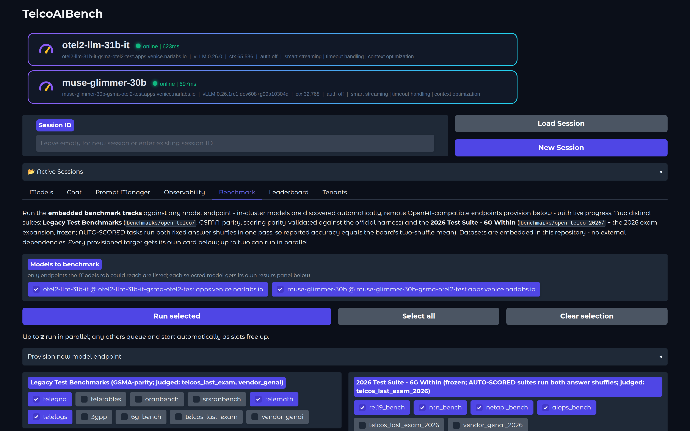
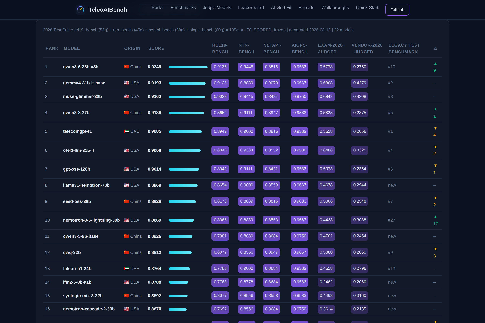
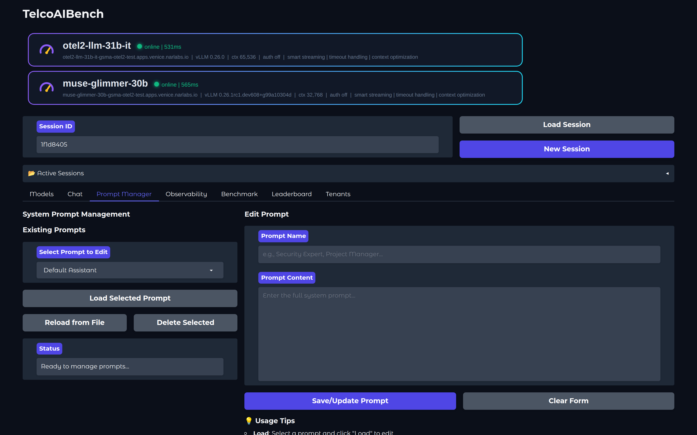
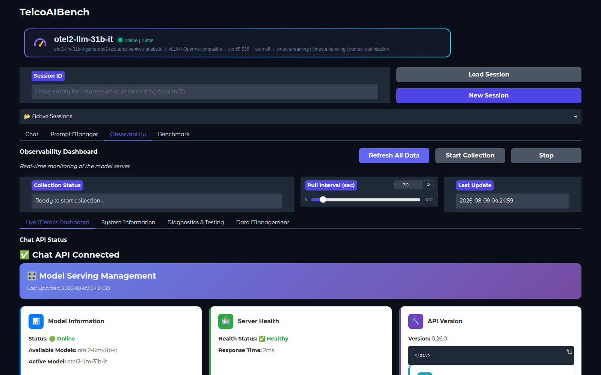
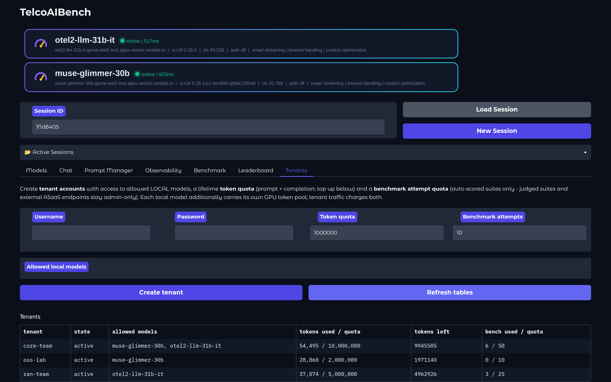
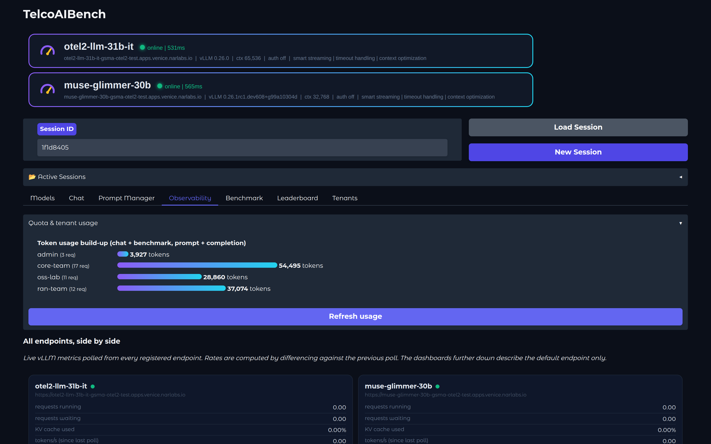
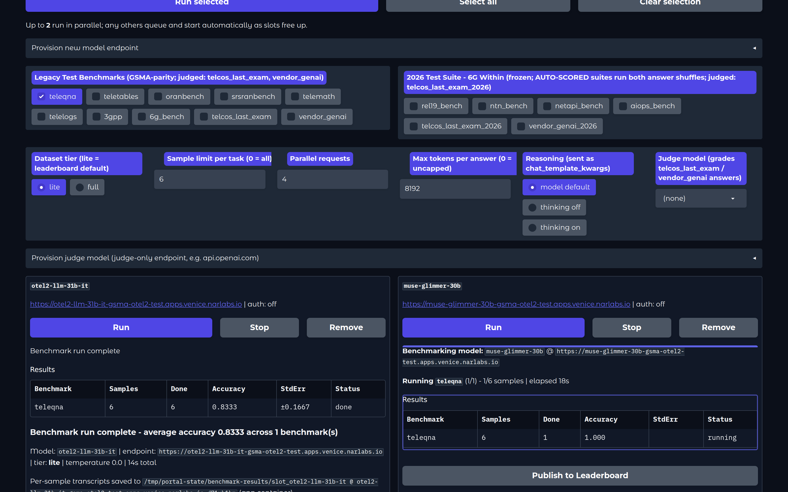
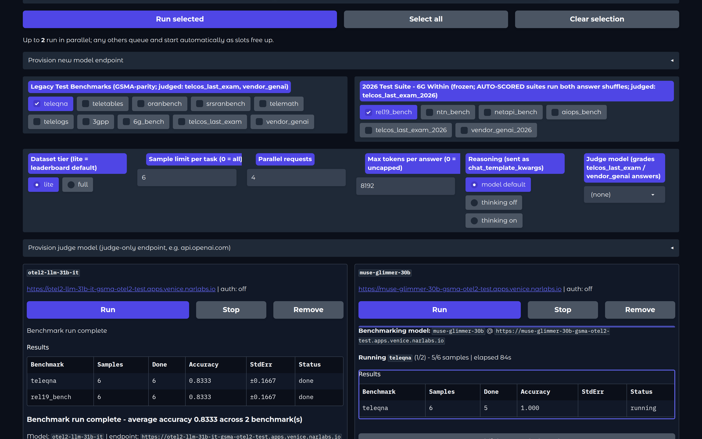
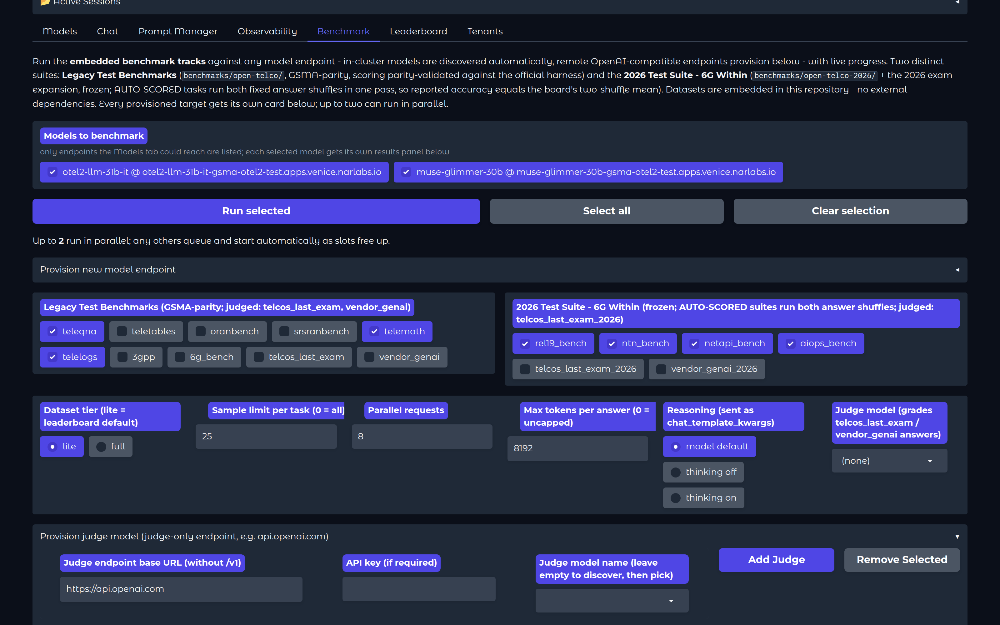
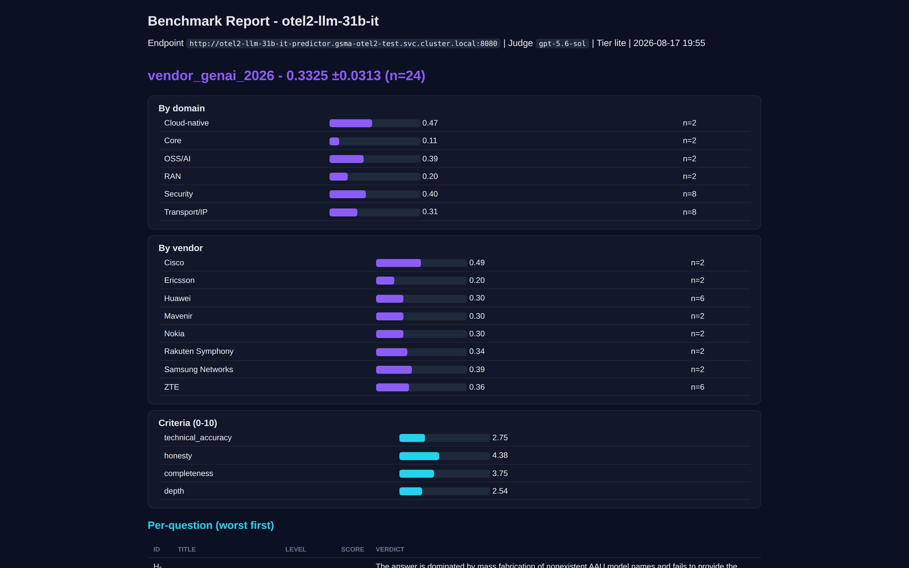

<div align="center">


**A self-contained portal & benchmark suite to measure any telco AI model - chat with it, watch it, benchmark it.**

[](LICENSE)
[](https://www.python.org/)
[](https://gradio.app)
[](benchmarks/README.md)
[](https://open-experiments.github.io/telcoaibench/)
[](benchmarks/open-telco/datasets/PROVENANCE.md)

 [Landing Page](https://open-experiments.github.io/telcoaibench/) &nbsp;|&nbsp;  [Article](https://medium.com/open-5g-hypercore/episode-xxix-the-prompt-engineering-how-to-make-a-toddler-act-talk-nice-83e9aab2e3b9) &nbsp;|&nbsp;  [Benchmark Suites](benchmarks/README.md) &nbsp;|&nbsp;  [Verification Report](benchmarks/open-telco/reference/)



</div>

---

## What is TelcoAIBench?

Point it at **any OpenAI-compatible endpoint** (vLLM, RHOAI/KServe, TGI, SaaS)
with two environment variables, and you get three things:

|  **Portal** |  **Two Benchmark Tracks** |  **Receipts** |
|---|---|---|
| Expert telco chat personas, live vLLM observability, multi-tenant quotas - persistent sessions, streaming, file upload. | **Legacy Test Benchmarks**: the 8 GSMA-parity Open-Telco suites + 2 LLM-as-judge suites. **2026 Test Suite · 6G Within**: 4 frozen AUTO-SCORED suites (195q, Rel-19/6G, NTN, network APIs, AIOps) + 2 judged expansions (Exam-2026, Vendor-2026). Datasets embedded in this repo - run from the UI or CLI, no external dependencies, ever. | Scoring parity-validated against the official GSMA harness (≤1pp on all 7 leaderboard tasks), frozen two-shuffle datasets with SHA-256 manifests, per-model report cards, and a full leaderboard-claim verification report. |

The tracks measure different things, and they disagree in instructive ways:
across 25 models the AUTO-SCORED composite, the judged exam, and the judged
vendor matrix each produce a **different #1** - the strongest argument we know
for never selecting an operational model off a single benchmark axis.

## The Boards



The [landing page](https://open-experiments.github.io/telcoaibench/) renders
two public boards from versioned snapshots in `docs/data/`:

**Legacy Test Benchmarks** - 31 ranked models on the importance-weighted
composite (judged suites weigh heaviest; ≥70% weight coverage, full-set runs,
one consistent judge).

**2026 Test Suite · 6G Within** - 25 models on the equal-weight mean of the
four AUTO-SCORED suites, with informational judged columns (Exam-2026,
Vendor-2026), origin, legacy-rank Δ, and **click-to-sort on every score
column**. Each model links to a [report card](benchmarks/model-reports/2026-reports/)
with per-suite shuffle scores and serving notes.

**AI Grid Tier Fitment** - all 43 benchmarked models placed on the AI Grid's
five placement tiers (RAN-embedded → User Edge → Provider Edge → Region →
Core DC), derived from measured accuracy, decode speed, verbosity, and VRAM
footprint - not parameter count.

Design, freeze protocol, and scoring amendments live in the
[2026 track design doc](benchmarks/2026-track-design.md).

## Quick Start

```bash
# 1. serve a model anywhere (example: vLLM)
vllm serve <your-model> --port 8080

# 2. point TelcoAIBench at it - no source edits
pip install 'gradio>=5,<6' && pip install -r requirements-v2.txt
export SME_API_ENDPOINT="https://my-model-route.apps.mylab"   # base URL, no /v1
export SME_MODEL_NAME="my-served-model-name"
export SME_TLS_VERIFY="false"                                 # lab self-signed certs
python sme-web-ui-v2.py                                       # :30180 | login admin/minad

# 3. or benchmark from the CLI (identical engine to the Benchmark tab)
cd benchmarks/open-telco
python3 otel_eval.py --endpoint https://<model-route>/v1 --model <name>            # legacy suites
python3 otel_eval.py --endpoint https://<model-route>/v1 --model <name> \
    --tasks rel19_bench,ntn_bench,netapi_bench,aiops_bench                         # 2026 track
```

<details>
<summary><b>All configuration variables</b></summary>

| Variable | Purpose | Default |
|---|---|---|
| `SME_API_ENDPOINT` | OpenAI-compatible base URL (no `/v1`) | - |
| `SME_MODEL_NAME` | served model name | - |
| `SME_API_TOKEN` / `SME_USE_TOKEN_AUTH` | bearer auth | `true` |
| `SME_TLS_VERIFY` | TLS verification | `false` |
| `SME_ADMIN_USERNAME` / `SME_ADMIN_PASSWORD` | portal login (changeable in the Tenants tab) | `admin` / `minad` |
| `SME_STATE_DIR` | home for all mutable state: endpoint + judge registries, chat sessions, prompt personas, metrics archive, tenant accounts + quotas, benchmark transcripts. Point it at a persistent volume (e.g. a PVC mounted at `/data`) and everything survives pod restarts. | app dir |

Kubernetes/OpenShift: a minimal Deployment that clones this repo, pip-installs,
and sets the `SME_*` env vars is all it takes - plus a Service and
Route/Ingress on port 30180. The Benchmark tab works out of the box because
the datasets ship inside the repo.
</details>

## The Portal

<details>
<summary> <b>Chat - expert telco conversations</b></summary>
<br/>


Multi-persona chat (Telco / Network / Cloud / Storage experts, intent
classification, or your own), persistent shareable sessions, auto-streaming
for large contexts, live temperature/token controls, and document upload
(txt/md/csv/json/py/pdf).
</details>

<details>
<summary> <b>Prompt Manager - persona engineering</b></summary>
<br/>



Create, edit, and persist system-prompt personas (`system_prompts.json`)
without touching code - instantly available in Chat.
</details>

<details>
<summary> <b>Observability - live vLLM metrics</b></summary>
<br/>



Dual-API dashboard polling the model server's `/metrics`: request rates,
latency, token throughput, cache utilization, health, efficiency analysis,
and diagnostics - with Plotly visualizations.
</details>

<details>
<summary> <b>Tenants - multi-tenant quotas</b></summary>
<br/>



Admin-managed tenant accounts scoped to allowed local models: lifetime token
quotas (prompt + completion), benchmark attempt quotas (AUTO-SCORED suites
only - judged suites and external AIaaS endpoints stay admin-only), and
per-model GPU token pools. The admin password is changeable from the same
tab. The Observability tab tracks every tenant's token build-up live:


</details>

<details open>
<summary> <b>Benchmark - leaderboard-grade evals, one click</b></summary>
<br/>



**Two distinct tracks, one engine.** Pick suites from either checkbox group -
**Legacy Test Benchmarks** (GSMA-parity, scoring parity-validated against the
official harness) or the **2026 Test Suite · 6G Within** (frozen; AUTO-SCORED
tasks run both fixed answer shuffles in one pass, so reported accuracy equals
the board's two-shuffle mean) - plus tier, sample limit, parallelism, token
cap, and a reasoning on/off switch (sent as `chat_template_kwargs`). Results
stream in live and end in accuracy ± stderr per suite, the overall average,
and per-sample transcripts for auditing.

**Multi-model, side by side.** In-cluster models are discovered
automatically; any remote OpenAI-compatible endpoint provisions from the UI.
Every model gets its own **target card** - up to two run in parallel, others
queue - each with a live results table and a **Stop** button that hard-aborts
within seconds. Runs whose browser page closes are auto-cancelled too - no
orphaned GPU load.



**Judged suites.** Four of them: `telcos_last_exam` (30q, 8 domains, 246 pts)
and its 2026 expansion `telcos_last_exam_2026` (30 expert questions, 260 pts -
IMS/voice, OSS/BSS, regulatory, AI-ops, NTN, energy), graded against worked
reference keys with grading notes, points-weighted; `vendor_genai` (6 vendors
× 4 domains) and `vendor_genai_2026` (24 new cells - Huawei ×6, ZTE ×6,
legacy vendors × Transport/IP + Security), graded per-criterion (technical
accuracy 0.40 / honesty 0.25 / completeness 0.20 / depth 0.15) with fact
anchors and fabrication bait. A **judge model** you provision grades every
answer and returns structured JSON; judge endpoints never become benchmark
targets, and the judge is recorded alongside every score.



**Breakdowns and failure reports.** Every judged run ends with per-domain,
per-difficulty, per-vendor and per-criterion breakdowns inline, plus a
downloadable **run report** (HTML + markdown) listing every question
worst-first with its score, verdict, what was missed, and the judge's
written rationale.



**Leaderboard.** Every clean, full-set run is recorded automatically into a
persistent leaderboard (state volume). The **Leaderboard tab** ranks models
by an importance-weighted composite (judged suites weigh heaviest; weights
editable in `leaderboard_weights.json`) with three honesty rules: >= 70%
weight coverage to rank, full-set runs only, and one consistent judge -
scores from other judges are excluded and flagged. **Publish snapshot**
exports `leaderboard.json` + `LEADERBOARD.md`; commit them to
`docs/data/` and the [landing page](https://open-experiments.github.io/telcoaibench/#leaderboard)
renders the public board from the versioned snapshot.
</details>

## Benchmark Suites

All benchmark assets live under [`benchmarks/`](benchmarks/README.md):

| Suite | What it is |
|---|---|
| [`open-telco/`](benchmarks/open-telco/) | Self-contained Open-Telco eval framework - 8 GSMA telecom benchmarks, lite + full datasets embedded (~4.5MB gzipped JSONL), single-file runner (stdlib + `requests`). Parity-validated; includes leaderboard claim snapshots and the 2026-08 verification report. Also hosts the task registry for the 2026 suites. |
| [`open-telco-2026/`](benchmarks/open-telco-2026/) | **2026 AUTO-SCORED track** - Rel19-Bench (52q), NTN-Bench (45q), NetAPI-Bench (38q), AIOps-Bench (60q): 195 in-house functional-knowhow questions authored from primary 3GPP/ETSI/CAMARA/TM Forum/NGMN sources, SME-reviewed, frozen as two fixed answer shuffles (seeds + SHA-256 in the manifest). |
| [`telcos-last-exam/`](benchmarks/telcos-last-exam/) | Telco's Last Exam - legacy 30q/246pts plus the **2026 expansion** (30 expert questions, 260 pts, six new domains); LLM-as-judge against machine-verified answer keys with grading notes; points-weighted. |
| [`vendor-genai-tests/`](benchmarks/vendor-genai-tests/) | Vendor GenAI matrix - legacy 24 deep-dives (6 vendors × 4 domains) plus the **2026 expansion** (24 new cells adding Huawei, ZTE, Transport/IP, Security); per-criterion LLM-as-judge with fact anchors, fabrication bait, and honesty traps. |
| [`model-reports/`](benchmarks/model-reports/) | Per-model proof points behind the boards - [`legacy-reports/`](benchmarks/model-reports/legacy-reports/) (marathon + pre-marathon) and [`2026-reports/`](benchmarks/model-reports/2026-reports/) (one report card per 2026-board model: suite scores per shuffle, serving notes, golden configs). |

**Methodology & receipts.** Every published number is reproducible from this
repository alone: frozen datasets with SHA-256 manifests, two-shuffle scoring
(choice-ordering sensitivity measured up to ~9.6 points on a single shuffle -
the mean of both orderings bounds it), temperature 0.0 on a pinned serving
stack, per-model golden configs documented in the report cards, and one
consistent judge per board snapshot. MCQ parsing follows the `ANSWER: X`
protocol with the documented [parse v1.1 fallback](benchmarks/2026-track-design.md)
(adopted only after a zero-drift audit of all prior board models'
transcripts). The [verification report](benchmarks/open-telco/reference/)
documents exactly what happens when leaderboards skip this discipline.

## Repository Layout

```
telcoaibench/
├── sme-web-ui-v2.py        # The portal (Gradio): Models, Chat, Prompts,
│                           #   Observability, Benchmark, Leaderboard, Tenants
├── system_prompts.json     # Expert persona definitions
├── requirements-v2.txt     # Python dependencies (gradio pinned <6)
├── benchmarks/             # All benchmark & eval assets
│   ├── open-telco/         #   embedded eval framework: runner + datasets + reports
│   ├── open-telco-2026/    #   2026 AUTO-SCORED track: frozen suites + provenance
│   ├── telcos-last-exam/   #   telco exam (legacy + 2026 expansion) + answer keys
│   ├── vendor-genai-tests/ #   vendor matrix (legacy + 2026 expansion)
│   ├── model-reports/      #   proof points: legacy-reports/ + 2026-reports/
│   └── 2026-track-design.md#   track design, freeze protocol, parse amendments
└── docs/                   # GitHub Pages site: boards, tier fitment, assets, videos
```

<details>
<summary><b>Architecture notes</b></summary>

Single-file app (`sme-web-ui-v2.py`) with clean separations: **Config**
(env-var-driven, pluggable endpoint) | **ChatClient** (OpenAI-compatible HTTP
with smart streaming, retries, timeouts) | **SessionManager** (file-backed,
24h retention) | **MetricsCollector** (`/metrics` polling + Plotly) |
**TenantManager** (accounts, lifetime token quotas, bench attempt quotas,
per-model GPU pools, salted credential storage) | **ChatInterface** (Gradio
UI; the Benchmark tab imports `benchmarks/open-telco/otel_eval.py` directly).

Benchmark engine: SSE streaming by default (survives proxy/router idle
timeouts on long generations), deterministic scoring ported 1:1 from the
official harness (2026 suites add the documented parse v1.1 fallback), 8k
default token cap against runaway chain-of-thought, zero network dependencies
for datasets.
</details>

---

<div align="center">

*Graduated from the `telco-sme` experiment in
[Telco-AIX](https://github.com/open-experiments/Telco-AIX), where its full
development history lives. Contributions welcome - MIT licensed.*

</div>
